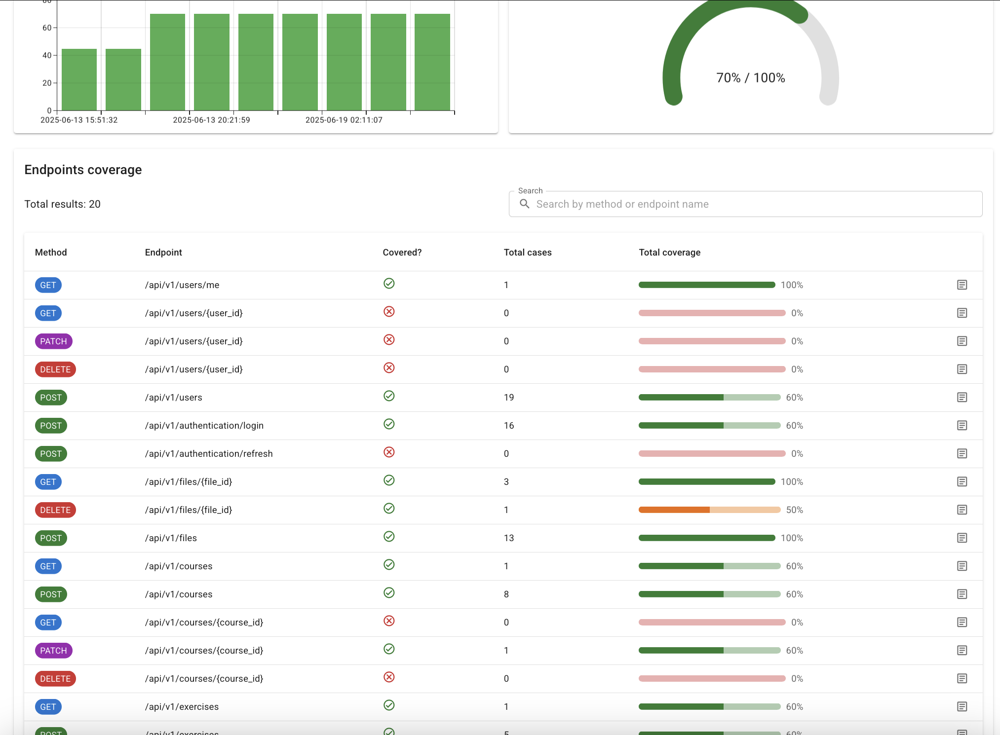

# <p align="center"> REST API Test Automation: <a href="https://github.com/Nikita-Filonov/qa-automation-engineer-api-course)"> API Course Test Server </a></p>

This project implements automated tests for API Test project available on [GitHub](https://github.com/Nikita-Filonov/qa-automation-engineer-api-course).

## Contents

> - [Project Overview](#project-overview)
> 
> - [Technology Stack](#technology-stack-and-tools)
>
> - [Run Tests Locally](#run-tests-locally)
>
> - [View Allure Report](#view-allure-report)
>
> - [View coverage Report](#view-coverage-report)
>
> - [See the Report on GitHub Pages](#see-the-report-on-github-pages)

### Project Overview

This project is focused on REST API testing using industry leading tools and technologies.
The automated tests are written using **Python**, **Pytest**, **Allure**, **Pydantic**, **Faker** and **HTTPX**.
They aim to verify various functionalities of the application to ensure its stability and correctness.


This project is specifically designed for API autotests, incorporating best practices such as:

- API Clients for structured interaction with endpoints,
- Pytest fixtures for reusable and maintainable test setups,
- Pydantic models for strict data validation,
- Schema validation to ensure API contract correctness,
- Fake data generation to simulate real-world scenarios,
- The project structure follows industry standards to ensure clarity, maintainability, and scalability of the test code.

> [!TIP]  
> **GitHub Actions** are used to run tests, generate reports and publish the [results](https://alzuewa.github.io/autotests-api/).
> 
> [See below](#run-tests-locally) how to run them locally.
>

### Technology Stack and Tools
<p  align="center">
    
    
     
    
    
    
</p>

### Run Tests Locally

1. Clone the repository

```bash
git clone https://github.com/alzuewa/autotests-api.git
```

2. `cd` to the project's directory

```bash
cd autotests-api
```
3. In project root create virtual environment

###### Linux / MacOS

```bash
python3 -m venv venv
source venv/bin/activate
```

###### Windows

```bash
python -m venv venv
venv\Scripts\activate
```

4. Install dependencies

Once the virtual environment is activated, install the project dependencies listed in `requirements.txt`:

```bash
pip install -r requirements.txt
```

5. Run the tests with Allure Report generation

```bash
pytest -m 'regression' --alluredir=allure-results
```

This will execute all tests in the project and display the results in the terminal. Also, `allure-results` directory will appear in the project root.

### View Allure Report

After the tests have been executed, you can generate and view the Allure report with:

```bash
allure serve allure-results
```
This command will open the Allure report in your default web browser.
See all needed details on tests run, get its logs and details on failures:
<p align="center">
    
</p> 

### View coverage Report

This project uses `swagger-coverage-tool` [library](https://github.com/Nikita-Filonov/swagger-coverage-tool) which builds visual analytics for API tests coverage based on service's Swagger specification.

After [running tests locally](#run-tests-locally), `coverage-results` directory was created. To get a report on API coverage locally, run:
```bash
swagger-coverage-tool save-report
```
You see new files have appeared in project root: `coverage.html`, `coverage-history.json`, `coverage-report.json`.

Open `coverage.html` and see the graphs on total endpoints covered, revealing response codes, body-data and query params coverage.

<div style="display: flex;">
    <div style="margin: 5px; width: 50%;">
        
    </div>
    <div style="margin: 5px; width: 50%;">
        
    </div>
</div>


### See the Report on GitHub Pages
> [!NOTE]  
> You can get Allure Report on the project tests run from **GitHub Pages** [here](https://alzuewa.github.io/autotests-api/).
>
